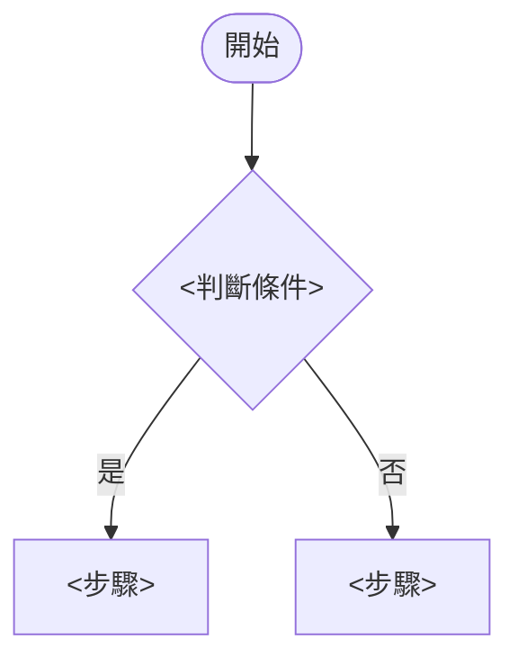

# engineering-spec.md 模板

起草或修訂 `engineering-spec.md` 時使用本模板。

寫作規則（跨文件與文件內的單一事實來源、表格單格上限、精簡準則）見 `writing-rules.md`；技術內容的三種約束程度見 `constraint-levels.md`。兩者都是本模板的前提，起草前必讀。

文件**不切成「SA」「SD」兩大章**。系統分析與系統設計是寫作者腦中的分層，不外顯成章節標籤——讀者拿到的是一份連貫的規格。

## Required Style

- 繁體中文，台灣軟體開發常用語。
- 除標點符號外，所有特殊符號一律半形。
- 每個事實只在其權威章節定義一次；需求類事實引用 Matt Spec，不複製。
- 表格單格內容超過約 80 字時改用小節。
- 只有三種標記：`> **設計決策**：`、`> **實作方向**：`、「待釐清事項」的一列。不使用來源標記欄位。
- 不寫成 coding plan、commit 計畫或 Ticket 清單。
- 不出現「此部分由下游設計」「留待後續補充」等轉嫁語句。
- 章節依實際情境選用；無關者依下方「章節去留」處置，不留只有標題或填「無」的空洞章節。
- 不寫讀者能自己推導出來的內容（見 `writing-rules.md` 第四章）；推導不明顯但重要的，收斂成一條設計檢核點。
- 沒有 Agent 對話痕跡、沒有開發過程日誌、沒有內部工作註記（「修訂紀錄」一列一句除外）。
- 本模板產出的是**工作版**。要貼回公司 GitLab Issue 時，由 `engineering-spec-deliverable` 產出交付版，不在此就地改寫。

## Markdown Structure

````text
# <功能名稱> 開發規格

## 文件資訊

| 項目 | 內容 |
| --- | --- |
| 功能名稱 | <功能名稱> |
| 所屬模組 / 系統 | <模組名稱> |
| Matt Spec | [spec.md](./spec.md)（需求、範圍、行為與驗收基準的權威） |
| 相關 ADR | <docs/adr/0007-xxx.md，一行一則帶一句摘要；無則填「無」> |
| 公司 Issue | <GitLab Issue 連結或編號；無則省略此列> |
| 專案類型 | <既有專案 / 全新專案> |
| 文件狀態 | <分析中 / 設計中 / 可拆 Ticket / 定稿；附日期> |

## 一、背景與目的

<1-2 段：這個功能為何存在、支援什麼使用情境、在系統中的核心職責是什麼。>

**不重寫 user stories。** 需求細節見 [spec.md](./spec.md)；此處只交代系統視角的定位。

**邊界定位**：<相關但不在本次範圍的功能、前後階段、後續模組，說明它們與本功能的關係。無則省略此段。>

## 二、範圍與非範圍

> 此章寫**系統邊界**——哪些模組會被動到、哪些明確不動、哪些資料不碰。產品層級的 Out of Scope 見 [spec.md](./spec.md)，不在此重複。

| 類型 | 項目 | 說明 |
| --- | --- | --- |
| 包含 | <模組 / 資料 / 流程> | <本次會動到什麼> |
| 部分包含 | <項目> | <講清楚哪一部分動、哪一部分不動> |
| 不包含 | <項目> | <為何排除、由誰承接> |

## 三、角色與權限

> 權限模型：<一至數句說明權限如何分組、範圍 / 依賴邏輯如何運作。依專案實際採用的權限機制描述，不寫死特定名詞。>

### 權限清單

| 權限 | 涵蓋動作 | 說明 |
| --- | --- | --- |
| <權限鍵或權限名稱> | <涵蓋哪些動作> | <說明> |

### 依賴判斷

<當「有權限」還不足以放行、另需資料歸屬 / 層級 / 狀態等依賴條件時使用；無此類依賴則整節省略。>

**為每個依賴條件取一個具名判斷式並在此定義一次**，後續章節一律引用名稱，不重述判斷內容：

| 判斷式 | 定義 | 適用動作 |
| --- | --- | --- |
| `<判斷式名稱>` | <精確定義：需要滿足什麼條件> | <引用動作名稱（有狀態機時在第四章的動作對照表，無狀態機時在下方的動作與權限對照）> |

**例外**：<豁免上述依賴的角色或身分，以及豁免的邊界。無則省略。>

### 動作與權限對照

<**只有無狀態機的功能才有本節**；有狀態機時，本表帶著「狀態轉移」欄放在四、動作對照表，此處整節省略。兩處不並存。>

本表是**動作與其權限、依賴、副作用的唯一權威**。其他章節引用動作名稱，不重述權限。

| 動作 | 權限 | 依賴 | 副作用 |
| --- | --- | --- | --- |
| <動作> | <權限鍵> | <引用上方判斷式名稱，無則 —> | <一句摘要 + BR 編號，如「見 BR-03：僅回傳所屬單位資料」；不可只填編號> |

## 四、狀態與流程

> **無狀態機的功能：** 不要保留一張「狀態轉移」欄全填「無」的表。動作與權限的對照移到三、角色與權限的「動作與權限對照」節，本章只保留仍有分支判斷的流程；連那個也沒有時，**整章省略**。

### 狀態圖

<涵蓋**所有**合法轉移，不是只畫主線。無狀態機的功能省略本節。>


### 動作對照表

<有狀態機時才有本節。無狀態機時本表降級為三、角色與權限的「動作與權限對照」。>

本表是**狀態轉移與其權限、依賴、副作用的唯一權威**。其他章節引用動作名稱，不重述轉移或權限。

| 動作 | 狀態轉移 | 權限 | 依賴 | 副作用 |
| --- | --- | --- | --- | --- |
| <動作> | <前狀態 → 後狀態> | <權限鍵> | <引用第三章判斷式名稱，無則 —> | <一句摘要 + BR 編號，如「見 BR-09：釋放圈存」；不可只填編號> |

### <其他流程名稱>

<狀態機之外、**有分支判斷**的流程才畫。線性流程用文字說明。>



**異常路徑：**
- <條件>：<處理方式一句摘要（BR 編號）；不可只寫編號>

## 五、功能介面

> 本章是**使用者看到什麼**的唯一權威：畫面上有哪些欄位、必填什麼、預設什麼、選項怎麼連動、從哪裡進來。程式之間傳什麼是八、介面契約的事；欄位的儲存型別與長度是九、資料與 Schema 的事。
>
> 屬於分析段——這些內容人可以直接審，不需要看 codebase。
>
> **無畫面的功能（批次、純 API、事件消費者）整章省略**，不要留空標題。

### 輸入與查詢條件

| 欄位 | 型態 | 必填 | 預設值 | 說明 / 限制 |
| --- | --- | --- | --- | --- |
| `<欄位名>` | <文字 / 下拉 / 日期 / 多選> | <是 / 否> | <預設值，無則 —> | <來源、格式、長度、可選範圍> |

### 選項與連動

<選單來源、層級連動、互斥或啟用條件。無連動時省略本節。>

| 觸發 | 影響 | 行為 |
| --- | --- | --- |
| <哪個欄位變動> | <哪些欄位> | <清空 / 重載 / 停用；選項來源> |

### 條件驗證與錯誤訊息

> **本表是欄位驗證錯誤訊息原文的唯一位置。** 背後是業務規則的驗證，訊息寫在該 BR 的「錯誤處理」，此處只列欄位名 + 一句摘要 + BR 編號，不重抄訊息。分界見 `writing-rules.md` 的三問。

| 情境 | 訊息 / 行為 |
| --- | --- |
| <違反條件> | <訊息原文以引號標出；或引用「見 BR-xx：一句摘要」> |

### 結果呈現

| 欄位 | 來源 | 格式 | 說明 |
| --- | --- | --- | --- |
| `<欄位名>` | <哪張表 / 哪個計算> | <日期格式、數值精度、空值顯示> | <排序、可否點擊、寬度以外的語意> |

<分頁、排序預設、筆數上限、匯出格式與範圍，寫在表格下方一段。>

### 入口與導向

| 入口 | 位置 | 進入條件 | 帶入參數 |
| --- | --- | --- | --- |
| <選單項 / 按鈕 / 連結> | <選單路徑或所在頁面> | <權限鍵；引用三、角色與權限> | <帶哪些查詢條件或識別碼> |

<移除的舊入口也列入，說明取代關係。>

> **設計決策**：<欄位語意、必填性、預設值屬於設計決策。版面位置、元件選型、欄寬屬於實作方向，另以 `> **實作方向**：` 標明。>

## 六、業務規則與例外

> BR 描述在什麼條件下、以什麼約束來做，以及違反時如何處理。**每條規則一個小節**——規則往往需要交代條件、多種錯誤情境與實作約束，表格單格塞不下。
>
> **本章只放業務規則。** 欄位規格、選項連動、畫面配置與入口位置屬於「功能介面」章；欄位型別與長度屬於「資料與 Schema」章；動作與權限的對照屬於動作對照表。判準見 `writing-rules.md` 的「這條該不該是 BR」三問。
>
> BR 編號一經產生即為穩定識別碼（設計檢核點、Ticket、code review 都引用它），**修訂時不重新編號**；分類需調整時給新編號、舊編號標記廢棄。

### BR-01 <規則標題>

<規則本文：這條規則要達成什麼業務效果、在什麼條件下成立。可分段、可條列、可含子表格。

**只寫業務效果。** 程式落點是七、模組責任的事，畫面行為是五、功能介面的事，「不可只靠前端擋」是十三、設計檢核點的事——都不重複寫進這裡。規則若定義為「與 X 相同，除了 Y」，就寫這一句，不要把 X 的內容逐條展開。見 `writing-rules.md` 第四章。>

**錯誤處理**

| 情境 | 回應 |
| --- | --- |
| <違反條件> | <錯誤訊息 / 阻擋 / 警告；訊息原文以引號標出> |

**實作約束**

<這條規則對實作的硬性要求：交易邊界、原子性、檢查順序、冪等。這裡是這些約束的**唯一**權威位置。系統層級的併發模型寫在第十章，不在此重述。設計段才填寫；分析段留空或省略此區塊。>

> **設計決策**：<已確認、必須遵守的判斷>（理由：<為何這樣選>；替代方案：<被排除的方案與原因，無則省略>）

### BR-02 <規則標題>

<同上結構。無錯誤處理或無實作約束的規則，省略對應區塊，不留空標題。>

## 七、模組責任

> 設計段才產出。承接前六章已定案的分析結果，交代**程式落點**；不回頭重新解讀需求。

| 模組 / 層級 | 責任 | 約束程度 |
| --- | --- | --- |
| `<Controller / Service / Repository / ViewModel / Job / Event 等>` | <責任邊界、不可耦合的範圍> | <設計決策 / 實作方向> |

<新增或調整的組件與既有組件皆列入。責任邊界與「誰有權寫哪張表」屬於設計決策；建議封裝在哪一層、建議沿用哪個既有模式屬於實作方向。>

> **實作方向**：<建議的落點與可沿用的既有模式>

### 主要互動

<組件間的協作關係。組件數量少或關係顯而易見時省略本節。>

| 互動情境 | 發起方 | 接收方 | 傳遞內容 / 觸發條件 |
| --- | --- | --- | --- |
| <情境> | <組件> | <組件> | <傳遞什麼、何時觸發> |

## 八、介面契約

> 本章整章是**設計決策**——這些形狀改了，別人寫的程式會接不上。

| 介面 / API / Event | 權限 | 契約 |
| --- | --- | --- |
| `<method + path 或事件名>` | <權限鍵> | <request、response、狀態碼；狀態轉移與依賴引用第四章動作名稱，不重述> |

<需要精確描述型別 shape 時：>

*實作示意（非固定簽章）*

```csharp
Task<Result<XxxId>> DoSomethingAsync(XxxId id, UserId actor, CancellationToken ct);
```

<若某個型別 shape 本身就是契約（改了會接不上），不掛「非固定簽章」註記，改以 `> **設計決策**：` 標明「此形狀為契約」。>

## 九、資料與 Schema

> 不涉及 persisted data 變更時，說明資料來源與查詢策略、明確寫出無 schema change，並省略以下子節。涉及時先讀 `data-design-checklist.md`。
>
> 本章整章是**設計決策**。

### 概念模型

| 實體 / 整合點 | 概念說明 | 關係 / 依賴 |
| --- | --- | --- |
| <業務實體或外部系統> | <概念上代表什麼> | <與其他實體或系統的關係> |

### `<資料表名稱>`（<新增 / 複用 / 複用並擴充>）

| 欄位 | 型別 | 必填 | Key / Index | 說明 |
| --- | --- | --- | --- | --- |
| `<欄位>` | `<SQL / storage 型別>` | <是 / 否> | <PK / FK / unique / index> | <用途、來源、生命週期或限制> |

**Enum / Lookup 異動**

| 資料項目 | 決策 |
| --- | --- |
| `<enum 或 lookup>` | <新增哪些值、是否 append-only、程式端 enum 與 seed 是否同步> |

**索引**

- 第一版必要：<支援核心查詢 / 唯一性 / 一致性的索引>
- 後續評估：<有依據但可延後，待資料量或使用頻率再評估>

**資料所有權 / source of truth**：<哪張表對哪個事實具權威；衍生值與歷史值如何取得。>

**交付方式**：<schema 變更、seed、backfill、rollback 的交付產出物（例如 `.SQL`）。不假設有 migration framework；未指定時列入待釐清事項。>

## 十、交易與併發

> 只寫**跨規則、系統層級**的併發模型。單條規則的交易邊界寫在該 BR 的「實作約束」，不在此重述。
>
> 每一列都要通過一個測試：把它搬進某條 BR 會不會更合適？會，就搬過去。全部都能搬走時，整章省略。

| 項目 | 決策 |
| --- | --- |
| 隔離等級 | <維持預設 / 特定操作提升，以及理由> |
| 併發控制策略 | <樂觀 / 悲觀、以哪個欄位或條件判斷> |
| 衝突後的行為 | <重試次數、回捲範圍、回給使用者的訊息（引用 BR 編號 + 摘要）> |
| 鎖順序 | <多表寫入時的固定順序，避免死鎖> |
| 交易外的副作用 | <寄信、發事件、寫 log 等必須在交易外或可補償的動作> |

> **設計決策**：<本次採用的併發模型>（理由：…；替代方案：…）

## 十一、相容性與風險

| 項目 | 影響 | 處理 |
| --- | --- | --- |
| <既有資料 / 既有 API / 既有流程 / 第三方整合> | <會被怎麼影響> | <向後相容做法、灰度、rollback、或明確接受的破壞性變更> |

<沒有相容性影響時，明確寫一句「本次無破壞性變更」，不要留空章節。>

## 十二、待釐清事項

| 問題 | 影響範圍 | 建議處理方式 |
| --- | --- | --- |
| <Q1；若沒有，填寫「目前無待釐清事項」> | <影響哪個分析結果或設計判斷；若沒有，填「無」> | <建議由誰回答或如何確認；若沒有，填「無」> |

## 十三、設計檢核點

> **驗收基準的權威是 [spec.md](./spec.md)。** 本章不重寫 user stories，只補「設計正確性檢核」——Matt Spec 表達不出、但設計上必須成立的事。
>
> 一條一句可判斷真偽的結果陳述 + 依據編號。與 Matt Spec 驗收基準重疊者刪除。

| 編號 | 檢核點 | 依據 |
| --- | --- | --- |
| DC-01 | <一句可判斷真偽的設計正確性陳述> | <BR-04 / 十、交易與併發 / spec.md User Story 12> |

<定稿模式追加一欄「驗證結果」（通過 / 未驗證 / 不適用）。>

## 十四、交給 to-tickets

本文件狀態為 `可拆 Ticket` 時，拆票與實作要遵守的規則：

- **[spec.md](./spec.md)** 決定需求、範圍與驗收基準。本文件不覆蓋它；兩者衝突時停下來問人，不要自己選一邊。
- 本文件的 **設計決策**（`> **設計決策**：`，以及八、介面契約與九、資料與 Schema 兩章）是實作約束，Ticket 不得違反。要改，先回 `to-engineering-spec` 修訂文件。
- **實作方向**（`> **實作方向**：`）可依 codebase 現況合理調整，但要在 Ticket 或 PR 記錄原因。靜默偏離視同缺陷。
- **實作示意**（程式碼區塊上方標了「非固定簽章」）不是契約，不要照抄簽章。
- Ticket 採 **tracer-bullet vertical slices**：每片切穿 schema、API、UI、測試，各自可獨立驗證。**不按 Controller / Service / DB 分層拆工。**
- **Ticket 不等於單一 commit。**

## 附錄：修訂紀錄

| 日期 | 修訂內容 | 原因 |
| --- | --- | --- |
| <YYYY-MM-DD> | <一句話：改了哪一章的什麼> | <一句話> |

## 附錄：偏差與待處理

> 定稿模式才出現。實作與已確認設計不一致、且沒有正式修訂依據的項目列於此。**不得直接覆寫原設計。** 使用者確認接受該實作結果後，才修訂對應章節並刪掉該列。無偏差時整節省略。

| 編號 | 確認設計 | 實際實作 | 影響 | 待決 |
| --- | --- | --- | --- | --- |
| D-01 | <本文件原本說什麼（章節 / 編號）> | <程式碼實際做了什麼> | <差異造成什麼影響> | <接受實作並修訂文件 / 改回設計 / 待使用者裁決> |
````

## Section Guidance

- `文件資訊`：metadata，保持簡潔。`文件狀態` 反映流程進度（`分析中` → `設計中` → `可拆 Ticket` → `定稿`）。`Matt Spec` 列必填，它是需求權威的入口。
- `背景與目的`：一到兩段講系統視角的定位。**這裡最容易變成 Matt Spec 的換句話說**——寫完回頭檢查：有沒有一句話是 `spec.md` 已經說過的？
- `範圍與非範圍`：系統邊界，不是產品範圍。「不動 `OrderExport` 模組」是這裡的內容；「這一期不做行動版」是 Matt Spec 的內容。
- `角色與權限`：
  - `依賴判斷` 是本章的重點。當授權需要「權限 × 資料歸屬 / 層級 / 狀態」的組合時，**為每個依賴條件取一個具名判斷式**（例如 `CanActAsOriginator`），在此定義一次，後續一律引用名稱。沒有具名判斷式，同一段依賴邏輯會在權限表、動作表、介面契約、檢核點各重寫一次。
  - 判斷式刻意不含權限本身（保持正交），組合方式在權限模型摘要說明一次。
  - `動作與權限對照` **只在無狀態機時出現**。它跟第四章的動作對照表是同一張表的兩種型態，不是兩張表——家隨「有沒有狀態機」而定，任何情況下只存在一份。
- `狀態與流程`：
  - **先確認這個功能有沒有狀態機。** 沒有（唯讀查詢、報表、單純的設定頁）就不要硬套：一張「狀態轉移」欄整欄填「無」的表毫無資訊量，還會讓讀者以為漏寫。動作與權限的對照降級移進第三章，本章只留有分支判斷的流程，沒有就整章省略。
  - 狀態圖畫**完整**轉移，不畫「主線」再另用表格補其餘——那會產生兩份不一致的狀態機描述。
  - `動作對照表` 是密度最高的一張表，也是狀態機的權威。`副作用` 欄填**一句話 + BR 編號**，一句話不可省——只填編號的格會逼讀者跳轉才知道這個動作做了什麼。
  - 不另設「合法狀態轉移」表——動作對照表已涵蓋。
- `功能介面`：畫面欄位規格的家。**這一章存在的理由是：沒有它，欄位表、必填、預設值、選單與按鈕位置會無處可去，只好擠進 BR。** 與八、介面契約的分界是「使用者看到什麼」vs「程式之間傳什麼」——同一個欄位兩章都提到時，語意的權威在本章，wire shape 的權威在介面契約。欄位語意、必填性、預設值是設計決策；版面位置、元件選型是實作方向。無畫面的功能整章省略。
- `業務規則與例外`：一條 BR 一個 h3 小節。**寫每一條前先跑 `writing-rules.md` 的三問**——這一章是全文件最容易被灌入非規則內容的地方（欄位規格、畫面配置、範圍聲明）。`實作約束` 區塊吸收了「實作注意事項」章節的全部內容；本模板刻意沒有那個章節，不要自行加回來。
- `模組責任` / `介面契約`：交代程式落點。責任邊界是設計決策，封裝落點與沿用模式是實作方向——一列一列分清楚，別整章同一個溫度。
- `資料與 Schema`：整章是設計決策。涉及 persisted data 時先讀 `data-design-checklist.md`。
- `交易與併發`：只放跨規則的系統層級決策。這一章最容易復活成「實作注意事項」，寫每一列前都跑一次「能不能搬進 BR」的測試。
- `相容性與風險`：沒有影響也要明說一句，不要留空章節讓讀者以為漏寫。
- `待釐清事項`：必須保留。修訂時把已回答的項目移至對應章節的權威位置並刪除該列；無剩餘時填 `目前無待釐清事項`。
- `設計檢核點`：不與 Matt Spec 的驗收基準競爭。一條一句 + 依據編號。若一條需要三行才講得清楚，代表它在重述 BR。**安全與正確性的實作要求歸這裡**——「Server 端必須獨立驗權限，不可只靠隱藏按鈕」是檢核點，不是 BR。
- `交給 to-tickets`：必為正文最後一章，內容固定，照上面抄，不要每次重寫措辭——下游 Agent 靠這段的穩定性辨認約束程度。**`$to-tickets ...` 那一行指令不寫進文件**，它是給使用者的操作提示，只出現在回報訊息裡。
- `修訂紀錄` / `偏差與待處理`：附錄。修訂紀錄一列一句，是文件裡唯一允許的過程性內容。

## 章節去留

「章節依實際情境選用」不是模糊建議，是三種明確處置。**任何情況下都不留一個只有標題、內文寫「無」「N/A」「不適用」「本次無此需求」的章節或區塊。**

| 章節 / 區塊 | 無內容時 |
| --- | --- |
| 十二、待釐清事項 | **保留**，填一列 `目前無待釐清事項` |
| 十四、交給 to-tickets | **保留**，內容固定 |
| 九、資料與 Schema | **保留標題**，寫一句「本次無 schema 變更」加上資料來源與查詢策略，省略所有子節 |
| 十一、相容性與風險 | **保留標題**，寫一句「本次無破壞性變更」 |
| 四、狀態與流程 | 無狀態機且無分支流程 → **整章移除** |
| 五、功能介面 | 無畫面（批次、純 API、事件消費者）→ **整章移除** |
| 十、交易與併發 | 每一列都能搬進某條 BR → **整章移除** |
| 三、依賴判斷 / 例外 | 無此類條件 → **整節移除** |
| 五、選項與連動 | 無連動 → **整節移除** |
| 七、主要互動 | 組件少或關係顯而易見 → **整節移除** |
| BR 的「錯誤處理」/「實作約束」 | 該條規則沒有 → **整個區塊移除**，不留空標題 |

移除後，同層中文序號依實際保留的章節重編——只改序號，不改標題文字與章節順序。

**「保留標題 + 一句話」與「整章移除」的差別**：讀者拿到一份開發規格，會預期它交代資料與相容性；那兩章的沉默會被讀成漏寫，所以明說一句。其餘章節不存在就是不適用，讀者不會去找。

## 各模式的章節分佈

| 階段 | 產出章節 | 文件狀態 |
| --- | --- | --- |
| 建立 · 分析段 | 文件資訊、一 ~ 六（BR 的 `實作約束` 留空）、待釐清事項（暫編為 `七`） | `分析中` |
| 建立 · 設計段 | 回填 BR 的 `實作約束`、新增 七 ~ 十一、待釐清事項重編為 `十二`、新增 十三、十四 | `設計中` → `可拆 Ticket` |
| 修訂 | 就地改權威位置那一處；追加「修訂紀錄」一列 | 維持 `可拆 Ticket` |
| 定稿 | 同步已核准的變更、設計檢核點加「驗證結果」欄、必要時追加「偏差與待處理」附錄 | `定稿` |

分析段結束時文件只到「待釐清事項」，章節號暫編為 `七`；設計段插入後重編為 `十二`。重編只改序號，不改標題文字與章節順序。
